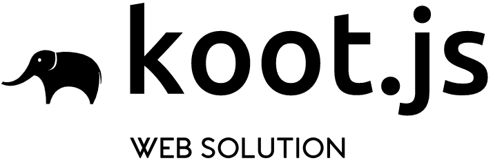

<!-- # Koot  -->
<p align="center">
    <a href="http://https://koot.js.org">
        
    </a>
</p>

<h3 align="center">
    Koot.js
</h3>

<p align="center">
    基于 <a href="https://facebook.github.io/react">React</a> 和 <a href="https://koa.bootcss.com/">Koa</a> 的完整前端技术解决方案。   
</p>

<p align="center">
    <a href="https://www.npmjs.com/package/koot">
        
    </a>
    <a href="https://www.npmjs.com/package/koot">
        
    </a>
    <a href="https://travis-ci.org/cmux/koot">
        
    </a>
    <a href="https://lernajs.io/">
        
    </a>
</p> 

## 快速使用

1. 安装命令行工具

```bash
> sudo npm i -g koot-cli
```

2. 初始化项目

```bash
> koot
```

3. 运行开发模式

```bash
> cd [项目名] && npm run dev
```

## 文档

**[查阅文档](https://koot.js.org)**

## 开源许可

Koot.js 使用 _Apache 2.0_ 开源许可证

[](https://opensource.org/licenses/Apache-2.0)
